<p align="center">
  <picture>
    <source media="(max-width: 600px)" srcset="./assets/hero-mobile.svg" />
    
  </picture>
</p>

<p align="center">
  <a href="https://github.com/Shivansh2207?tab=repositories"></a>
  <a href="https://www.linkedin.com/in/shivansh-vyas-9b509a315/"></a>
  <a href="mailto:shivanshvyas2207@gmail.com"></a>
</p>

<br />

<picture><source media="(max-width: 600px)" srcset="./assets/heading-about-mobile.svg" /></picture>

I’m **Shivansh**. I build for the web, for your phone, and for the people using both.

My sweet spot is where **a sharp interface meets a solid backend**: storefronts that feel good to browse, dashboards that make complicated work simpler, and mobile apps that do something useful. I like owning the whole journey, from the first layout to the last edge case.

**Currently in the mix:** React · Next.js · React Native · Expo · Firebase · Node.js

<br />

<picture><source media="(max-width: 600px)" srcset="./assets/heading-arcade-mobile.svg" /></picture>

<picture>
  <source media="(max-width: 600px)" srcset="./assets/arcade-mobile.svg" />
  
</picture>

<details>
<summary><b>🎮 Press START — choose your developer side quest</b></summary>

<br />

<details>
<summary>🐛 Fix one tiny bug</summary>

You fixed it. Three more appeared.

**Unlocked:** the debugger origin story.<br />
**Reward:** +1 patience. −1 afternoon.

</details>

<details>
<summary>🎨 Make one small UI tweak</summary>

The button is now 2 pixels to the left. So is your entire design system.

**Unlocked:** “while I’m here, I might as well…”<br />
**Reward:** an unreasonable amount of satisfaction.

</details>

<details>
<summary>🚀 Ship it</summary>

Somewhere, someone is using the thing that used to exist only in your head.

**Unlocked:** the whole point.<br />
**Reward:** a new idea immediately enters the queue.

</details>

<br />

<sub>No high scores. No leaderboard. Just the extremely normal developer experience.</sub>

</details>

<br />

<picture><source media="(max-width: 600px)" srcset="./assets/heading-stack-mobile.svg" /></picture>

<picture><source media="(max-width: 600px)" srcset="./assets/stack-mobile.svg" /></picture>

<details>
<summary><b>Open the developer console</b></summary>

<br />

```ts
const shivansh = {
  builds: ["web experiences", "mobile apps", "tools that save time"],
  caresAbout: ["the tiny UI details", "the data behind them"],
  defaultMode: "make it work, then make it feel right",
  sideQuest: "turn one more idea into a real thing",
};
```

If your idea lives somewhere between **“what if?”** and **“let’s build it”**, [say hello](mailto:shivanshvyas2207@gmail.com).

</details>

<br />

<picture><source media="(max-width: 600px)" srcset="./assets/heading-activity-mobile.svg" /></picture>

<a href="https://github.com/Shivansh2207?tab=overview"><picture><source media="(max-width: 600px)" srcset="./assets/github-signal-mobile.svg" />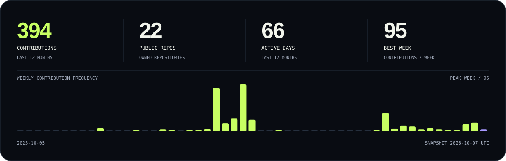</picture></a>

<p align="center"><sub>And now, a very hungry contribution snake.</sub></p>

<picture>
  <source media="(prefers-color-scheme: dark)" srcset="./assets/contribution-snake-dark.svg" />
  <source media="(prefers-color-scheme: light)" srcset="./assets/contribution-snake.svg" />
  
</picture>

<br />
<br />

<a href="mailto:shivanshvyas2207@gmail.com"><picture><source media="(max-width: 600px)" srcset="./assets/footer-mobile.svg" /></picture></a>

<p align="center">
  <sub>Built with intent. A little too much attention to detail. And probably another open tab.</sub><br />
  <sub><a href="./docs/PROFILE.md">Under the hood &amp; credits</a></sub>
</p>
